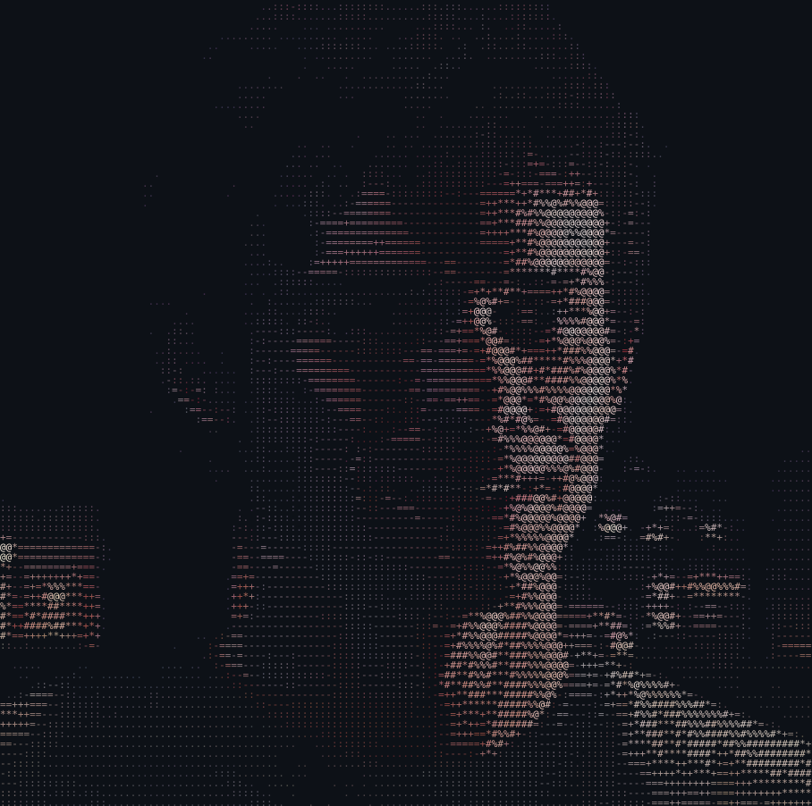

    
     

I write software that runs on your machine and stays there. Mostly Rust and TypeScript, mostly desktop, mostly things I wanted to exist and couldn't find. Outside the editor: martial arts, chess, and a novel I'm still writing.

Building
odyssey-design  ·  Rust Tauri TypeScript
A local-first desktop suite — documents, spreadsheets, decks, and a multi-track video editor. The timeline compiles the entire project into a single ffmpeg filter graph, so there are no intermediate renders and no scratch files. Keyframes lower to three different ffmpeg strategies depending on what the effect can express.

55 effects · real cross-dissolves with handle consumption · vidstab two-pass stabilisation · audio ducking via sidechain compression · ~180 tests, many of which render real video and assert on sampled pixels

tokenmeter  ·  TypeScript  ·  docs
Know where your LLM spend actually goes. A local proxy that attributes every token to a model, a repo, and a branch — then fails CI when a pull request regresses cost. Nothing leaves your network.

chess-engine-1600  ·  Engine
A ~1600 ELO engine with a GUI board, move analysis, and recommendations. Built to run on minimal hardware — no engine binary to install, no server round-trip.

nexus-video-editor  ·  Rust egui
Single-track editor, CLI and GUI, wrapping ffmpeg for trim / arrange / export. The small predecessor that taught me what the timeline in Odyssey needed to become.

Stack

           

Away from the keyboard
Ink Eye — my novel, published on WebNovel. Martial arts, chess, and an unreasonable number of books otherwise.

My favourite show is Dexter, btw.

        

